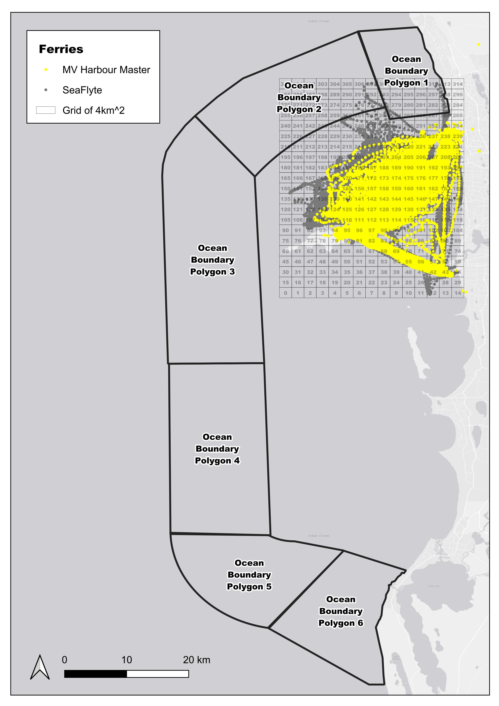
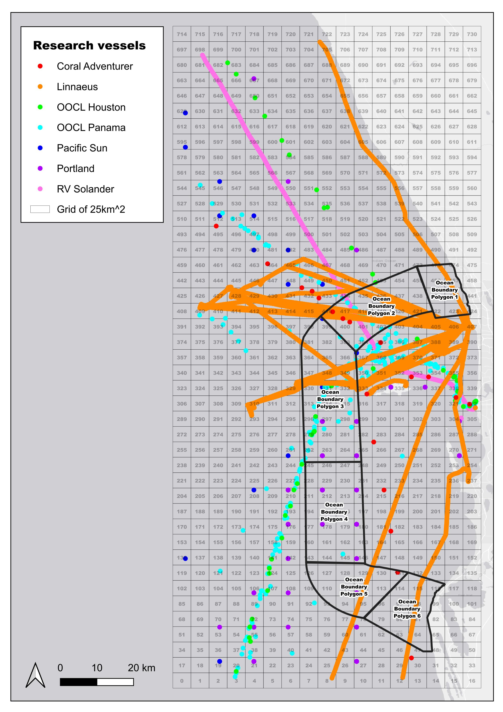

# Integrated Marine Observing System (IMOS) Import

## Ships of Opportunity (SOOP) Data
> [!NOTE]
> This is data is imported by the function importIMOSSOOP.py.

### Variable Conversion
| Variable ID | Variable Name | Conversion | Variable in ROMS |
| -------- | -------- | -------- | -------- |
| var00006 | Salinity | 1 | PSAL |
| var00007 | Temperature | 1 | TEMP |

### Raw Data
    /GIS_DATA/csiem-data-hub/data-lake/IMOS/SOOP/

### Processed Data
    /GIS_DATA/csiem-data-hub/data-warehouse/csv/imos/soop/

> [!IMPORTANT]
> The raw data is categorised into grids of 4km2 and take their averages for ferries: MV Harbour Master and Seaflyte; and into grid of 25km2 for research vessels: Coral Adventurer, Linnaeus, OOCL Houston, OOCL Panama, Pacific Sun, Portland, and RV Solander. Thus, the data is averaged and not representative of the exact location of the ferry or research vessel.
>
> |  |  |
> |:---:|:---:|

> [!WARNING]
> Coral Adventurer
> - No salinity data
> - Temperature data marked as “Instrument malfunction”
